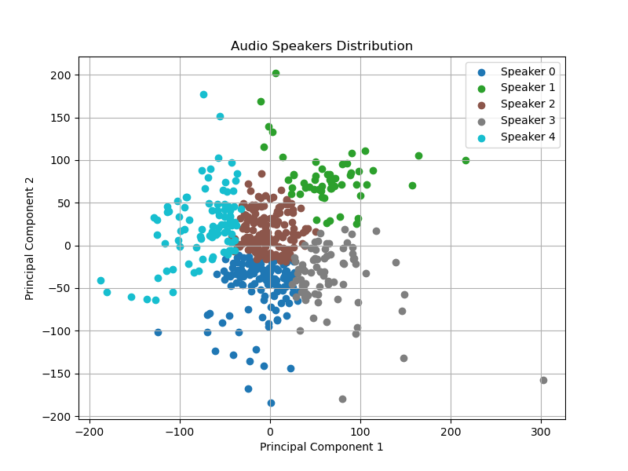

# Speaker Classifier

一个用于数据集处理时，自动分类出不同说话人音频的 Python 小工具。

# 注意：该工具准确率极低，目前请不要使用！！！上传上来仅仅作为我个人学习 Python 的一个代码存档

## 使用方法

1.  下载代码

    ```bash
    git clone https://github.com/SUC-DriverOld/Speaker-Classifier.git
    ```

2.  安装所需库

    ```bash
    pip install -r requirements.txt
    ```

3.  将你需要进行分类的音频文件放入 `dataset` 文件夹中，支持多条，长短不限
4.  若使用 SVM 模型进行分类：

    ```bash
    python use_svm.py -i INPUT_DIR -o OUTPUT_DIR -n SPEAKER_NUM
    ```

    若使用 XGboost 模型进行分类：

    ```bash
    python use_xgboost.py -i INPUT_DIR -o OUTPUT_DIR -n SPEAKER_NUM
    ```

> [!NOTE]
>
> 参数说明：
>
> 1. `-i`, `--input_dir`：数据集输入的文件夹，默认为 `dataset`。
> 2. `-o`, `--output_dir`：分类结果输出的文件夹，默认为 `output`。
> 3. `-n`, `--speaker_num`：需要分类的说话人数目，默认为 `5`。
> 4. 分类结果会以 `speaker_{num}` 命名，以单个文件夹形式，输出在 `output` 文件夹中。logs 文件夹内输出特征提取模型 `features.pkl`。若存在此文件，则下次运行时会直接读取特征，无需重新提取。除了输出 `features.pkl` 外，还会输出一张将特征降至二维的分布图，展示分类结果。
> 5. 若需要分类其他数据，请先清空 `logs` 文件夹和 `output` 文件夹内的内容!


